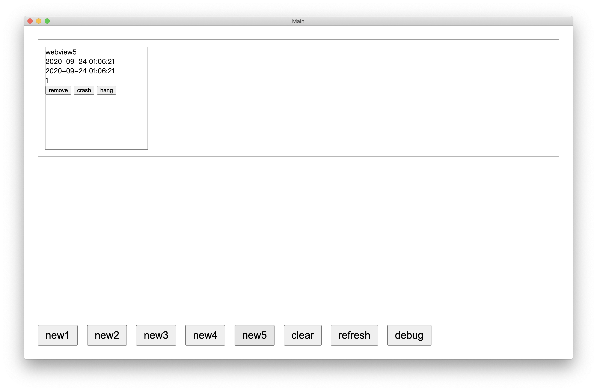

# electron-webview-schedule

[![NPM version][npm-image]][npm-url]
[![build status][travis-image]][travis-url]
[![Test coverage][coveralls-image]][coveralls-url]
[![npm download][download-image]][download-url]

[npm-image]: https://img.shields.io/npm/v/electron-webview-schedule.svg
[npm-url]: https://npmjs.org/package/electron-webview-schedule
[travis-image]: https://api.travis-ci.com/xudafeng/electron-webview-schedule.svg?branch=master
[travis-url]: https://travis-ci.com/github/xudafeng/electron-webview-schedule
[coveralls-image]: https://img.shields.io/coveralls/xudafeng/electron-webview-schedule.svg
[coveralls-url]: https://coveralls.io/r/xudafeng/electron-webview-schedule?branch=master
[download-image]: https://img.shields.io/npm/dm/electron-webview-schedule.svg
[download-url]: https://npmjs.org/package/electron-webview-schedule

> Webview scheduling management module supporting asynchronous queue for Electron.

---

## Installment

```bash
$ npm i electron-webview-schedule --save
```

## Usage

Import in the renderer process.

```javascript
import moment from 'moment';
import PromiseQueue from 'electron-webview-schedule/lib/promise-queue';
import WebviewSchedule from 'electron-webview-schedule/lib/webview-schedule';

const webviewSchedule = new WebviewSchedule({
  container: document.body,
  queue: new PromiseQueue(1),
  moment,
  webviewOptions: {
    eventsStack: [],
    attributes: {
    },
  },
});

webviewSchedule.send('channel-foo', args);
```

## Development

```bash
$ npm i
$ npm run dev
```



## License

The MIT License (MIT)
